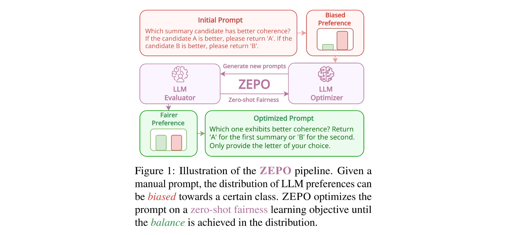

# Code for Fairer Preferences Elicit Improved Human-Aligned Large Language Model Judgments


**Link to paper**:
[Fairer Preferences Elicit Improved Human-Aligned Large Language Model Judgments](https://arxiv.org/abs/2406.11370). arXiv preprint arXiv:2406.11370.

## Installation

Run `source install.sh` to quickly create an virtual environment named ZEPO and install all dependencies.

```
source install.sh
```

Setup the OPENAI API for calling GPT-3.5-turbo.

```
export OPENAI_API_KEY=[YOUR_KEY]
```

## Quick Start: ZEPO

We provide a default script to reproduce our main experiments in optimizing the prompts for COH-SummEval.

```
sh run_zepo.sh
```

## Prompt Optimization

1. **Design your own prompts:** We provide default instruction to be optimized at ```init_prompts.json``` and the prompt template for corresponding tasks at ```prompts.py```. It is interesting to explore different initialization prompts and inspect the fairness.

2. **Use your own datasets:** Feel free to check the data formats that we have implemented in ```\data```, and it is easy to adapt other datasets to the same format and implement your own dataloader for conducting pairwise comparisons. 

3. **Support more advanced LLM prompt optimizers:** We have only studied a basic LLM optimizer to paraphrase the prompt and do greedy search in ```zepo.py```. Having more advanced LLM optimizers can enable more exploitation-driven prompt search in more diverse instruction formats. 

4. **ZEPO mitgates biases** Ideally, given a sufficient number of random sampling in pairwise comparisons, ZEPO can always optimize toward fairness, such that all representative biases can be mitigated in one goal, including position bias, verbosity bias, and self-preference bias. We welcome all extension study with respect to the impact of these biases and the extent that they are mitigated by ZEPO.

We acknowledge that some scripts were modified based on PairS.

## Citation

If you find our work to be useful, please cite:

```
@article{zhou2024fairer,
  title={Fairer Preferences Elicit Improved Human-Aligned Large Language Model Judgments},
  author={Zhou, Han and Wan, Xingchen and Liu, Yinhong and Collier, Nigel and Vulić, Ivan and Korhonen, Anna},
  journal={arXiv preprint arXiv:2406.11370},
  year={2024}
}
```
